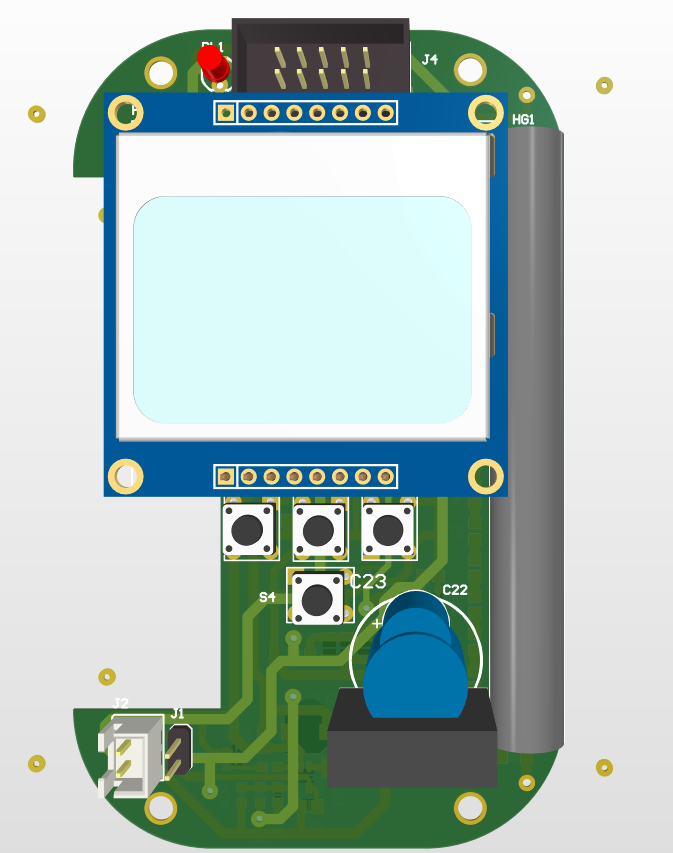
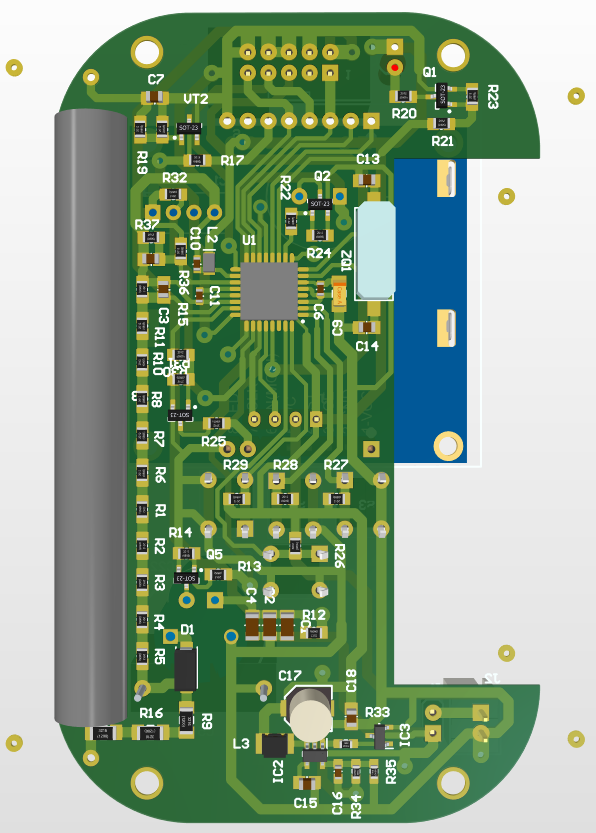
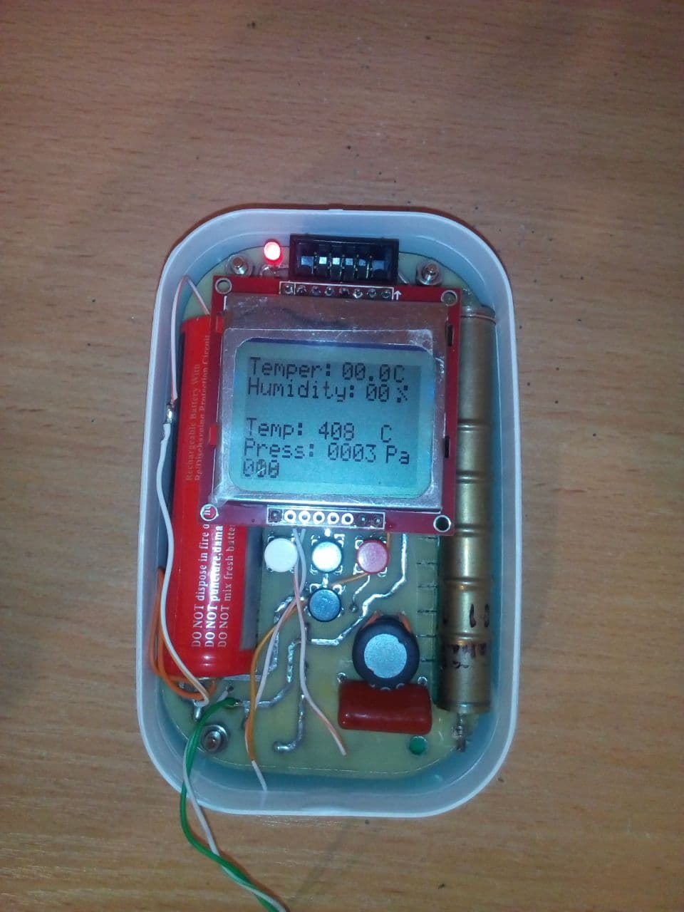
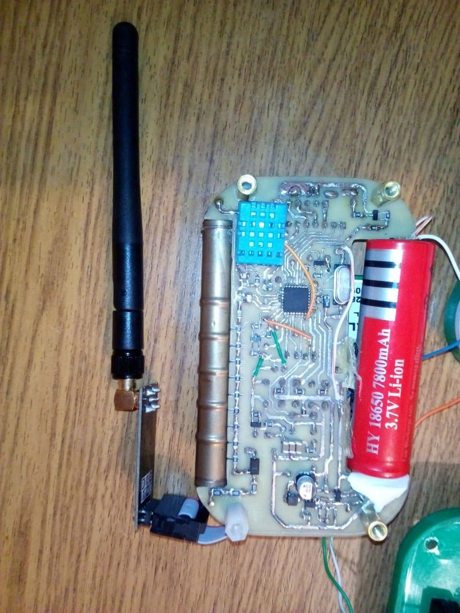
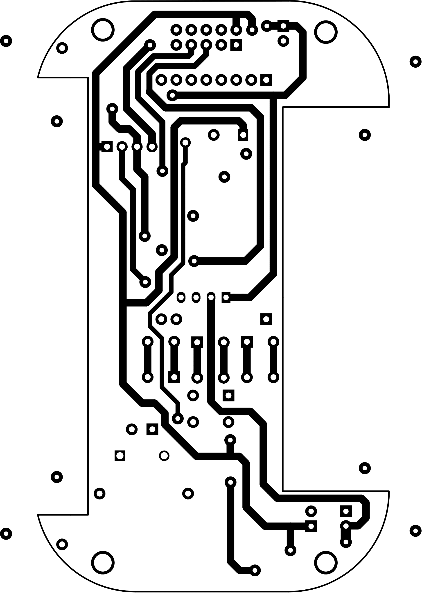
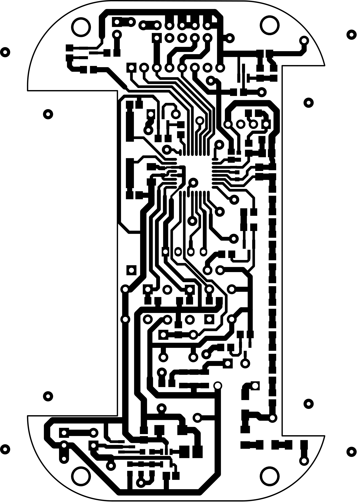
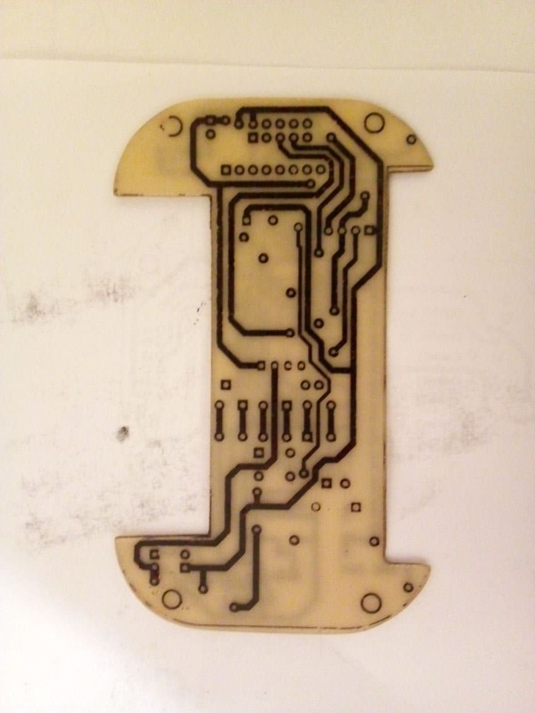
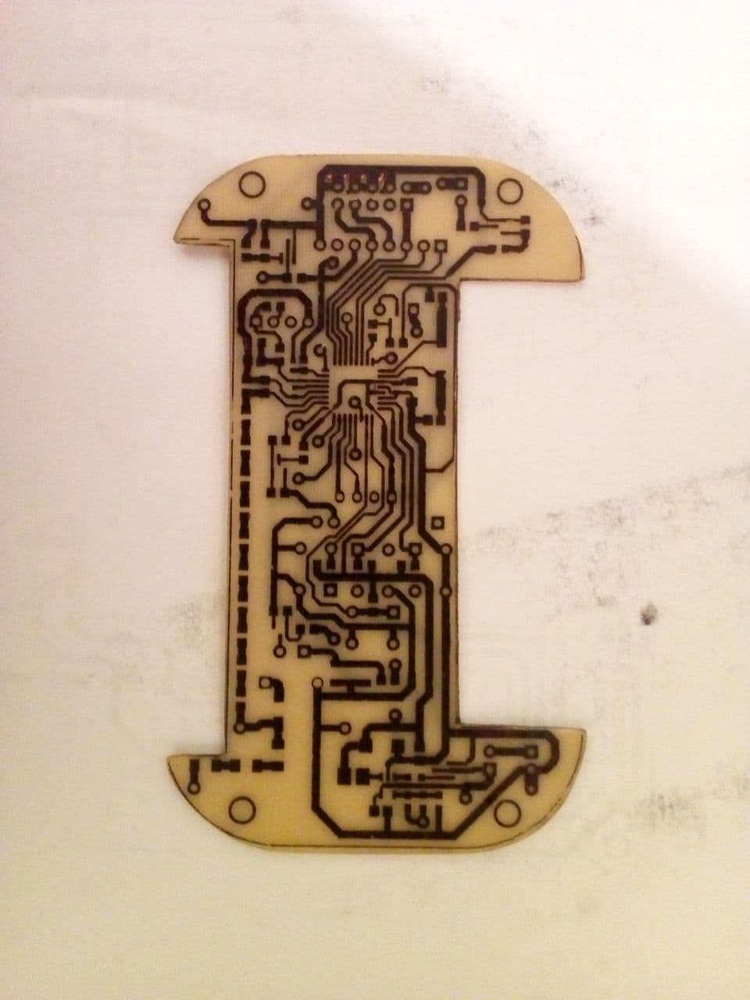
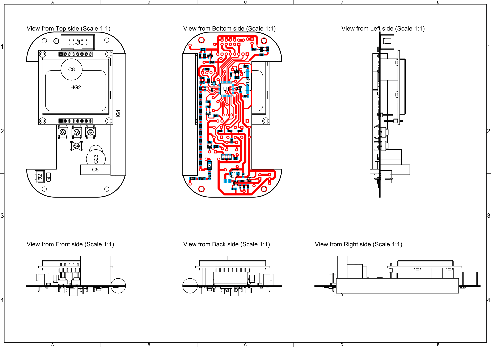

# Radiometer

This repository implements Radiometer featuring:
 - registration of hard beta and gamma radiation;
 - humidity and temperature measurement;
 - pressure measurement.

This project made for FLAT (Foil-laser-ironing technology)

# 3D model front panel in Altium Designer
## Front:

## Back:

# Real appearance:

Firmware in Atmel Studio: [Folder_of_Firmware](firmware/)

Schemes in Altium Designer: [Schemes_Dozimeter](Dozimetr/Dozimetr_v1.0/Project_Outputs_for_Dozimetr_v1.0/Schemes.PDF)

Altium Designer Project: [AD_Project](Dozimetr/Dozimetr_v1.0/)

# Printed circuit board for FLAT (Foil-laser-ironing technology)
## Top:

## Bottom:

Original files [here](Dozimetr/Dozimetr_v1.0/Project_Outputs_for_Dozimetr_v1.0/Job1.PDF)

# Real board made with FLAT:

# Draftsman

Original file [here](Dozimetr/Dozimetr_v1.0/Project_Outputs_for_Dozimetr_v1.0/Draw.pdf)
